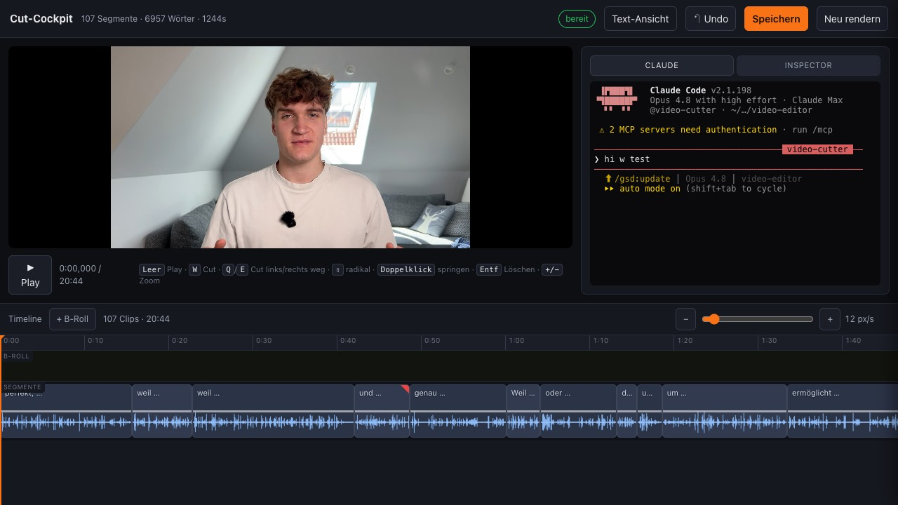

# Claude Video-Cutter

Ein Claude-Code-Agent, der lange Talking-Head- und Tutorial-Videos (20-90 Min,
deutsch) end-to-end schneidet: Verbatim-Transkription, redaktionelle
Cut-Entscheidungen (Retakes, Versprecher, Fehlstarts, Nicht-Content),
sample-genauer Schnitt an echten Pausen, QA über jede einzelne Naht — und am
Ende ein **Cut-Cockpit im Browser** mit CapCut-artiger Timeline und
integriertem Claude-Terminal für den Feinschnitt.

Das ist das echte Produktions-Setup von [Sebastian Kauffmann](https://www.skool.com/skaile)
(SKAILE Academy) — genau so, wie es täglich für seine Videos läuft.



## Was der Agent macht

1. **Transkribiert verbatim** (AssemblyAI mit best-guess-Prompt — Versprecher
   bleiben sichtbar, sonst kann man sie nicht schneiden)
2. **Entscheidet redaktionell**: Fenster-Subagenten finden Retakes
   (keep-last), ein Global-Pass wirft ganze Nicht-Content-Sektionen raus,
   ein Gegenleser prüft alles
3. **Schneidet deterministisch**: Der Agent liefert nur Wort-IDs, ein
   Energie-Solver misst die Schnittpunkte sample-genau aus der Waveform —
   nie mitten im Wort, nie im Sprachfluss
4. **Prüft jede Naht** (QA-Pyramide mit Whisper-Gegencheck + Auto-Repair)
   und rendert einen Proxy mit Beweisen (A/V-Sync, Hör-Stichproben)
5. **Übergibt ehrlich**: Review-Liste mit Graufällen + Cut-Cockpit im
   Browser (Timeline, Trimmen, Splitten, Gain, B-Roll-Slots, Re-Render —
   und rechts ein echtes Claude-Terminal mit dem Cutting-Agenten)

Philosophie: **Agent = Regie, Code = Kamera.** Der Agent entscheidet WAS
geschnitten wird, deterministischer Code entscheidet WO. Ziel sind 90%+
Automatik plus eine kurze, präzise Review-Liste — "100% ohne Draufschauen"
verspricht dir hier niemand.

## Voraussetzungen

- **macOS** (dort entwickelt und getestet; Windows/Linux ungetestet)
- **Claude Code** (Abo, [claude.com/claude-code](https://claude.com/claude-code))
- **ffmpeg** (`brew install ffmpeg`)
- **Python 3.12** (`brew install python@3.12` oder [uv](https://docs.astral.sh/uv/))
- **AssemblyAI-Account** (kostenlos, siehe Kosten)

## Kosten

| Was | Kosten |
|---|---|
| AssemblyAI-Account | **$50 Startguthaben gratis, ohne Kreditkarte** (Stand Juli 2026) |
| Transkription (async, Basisrate) | ~$0.21 pro Audio-Stunde — die $50 reichen für ~185 Stunden |
| Whisper-QA-Modell | kostenlos, läuft lokal (einmaliger Download ~3 GB beim ersten Lauf) |
| ffmpeg / Python | kostenlos |

Zur Einordnung: Sebastian nutzt denselben Account seit über einem Jahr für
seine Videoproduktion und hat davon rund $45 verbraucht.

## Installation (ein Prompt)

Öffne Claude Code und gib ihm diesen Prompt:

```
Klone das Repo https://github.com/sebaskauf/claude-video-cutter und lies
zuerst die INSTALL.md. Richte den Video-Cutter danach komplett bei mir ein:
Prüfe alle Voraussetzungen (macOS, ffmpeg, Python), baue die
Python-Umgebung und installiere den Agent und die Skills in mein
Claude-Setup. Führe mich danach Schritt für Schritt durch die
AssemblyAI-Einrichtung: Such mir den aktuellen Link zur kostenlosen
Registrierung raus, zeig mir, wo ich meinen API-Key finde, und trage ihn
für mich ein. Erkläre mir jeden Schritt kurz, bevor du ihn ausführst. Am
Ende zeigst du mir, wie ich mein erstes Video schneide und das Cut-Cockpit
im Browser öffne.
```

**Du nutzt das [Agentic OS Obsidian-Plugin](https://github.com/sebaskauf/agentic-os)?**
Dann nimm stattdessen diesen Prompt — er richtet zusätzlich den CUTTER-Tab
direkt in deinem Agentic OS ein:

```
Klone das Repo https://github.com/sebaskauf/claude-video-cutter und lies
zuerst die INSTALL.md und die INSTALL-AGENTIC-OS.md. Richte den
Video-Cutter komplett bei mir ein — inklusive der AssemblyAI-Einrichtung
mit aktuellen Links, wie in der INSTALL.md beschrieben. Ich nutze außerdem
das Agentic OS Obsidian-Plugin: Analysiere meine installierte Version,
aktualisiere sie auf die neueste Version mit dem CUTTER-Tab und binde das
Cut-Cockpit als eigenen Tab in mein Agentic OS ein. Erkläre mir jeden
Schritt kurz, bevor du ihn ausführst.
```

## Benutzung

Nach der Installation sagst du deinem Claude Code einfach:

```
schneide das Video /Pfad/zu/deinem/video.mov
```

Der Agent übernimmt alle vier Phasen (Transkription → Entscheidungen →
Schnitt+QA → Render+Übergabe) und öffnet am Ende das Cut-Cockpit auf
`http://127.0.0.1:8766/` — dort machst du den Feinschnitt: Clips trimmen
(mit echter Waveform), W/Q/E-Cuts wie in CapCut, Gain-Linie, B-Roll-Slots,
und rechts sprichst du direkt mit deinem Cutting-Agenten.

Rechne bei einem 60-Minuten-Video mit einer guten Stunde Laufzeit
(Transkription + Analyse + QA), die größtenteils unbeaufsichtigt läuft.

## Was drin ist

```
agent/video-cutter.md          Der Agent (10 Gesetze, 4 Phasen)
skills/video-cut-*/            Die 4 Phasen-Skills (Transkription,
                               Entscheidung, Pipeline, Übergabe)
scripts/                       Die deterministische Pipeline (Transkription,
                               Solver, QA, Cut, Re-Render, Cockpit-Server)
scripts/cockpit/               Das Cut-Cockpit (Browser-UI, self-contained)
```

## Grenzen (ehrlich)

- Optimiert für **deutsche** Talking-Head-/Tutorial-Videos
- **macOS-first** — auf Windows/Linux ungetestet
- Semantische Dopplungen ("dasselbe anders formuliert") findet kein System
  der Welt zu 100% — dafür gibt es die Review-Liste und das Cockpit
- Der Agent braucht Claude Code mit einem Modell auf Opus-Niveau für die
  redaktionellen Entscheidungen

## Lizenz

MIT — siehe [LICENSE](LICENSE). Gebaut von Sebastian Kauffmann / SKAILE,
mit Claude Code.
